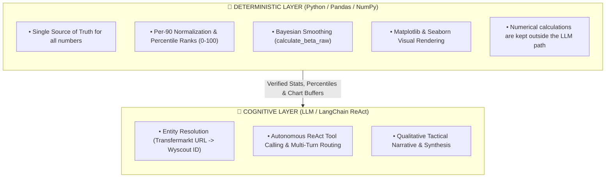
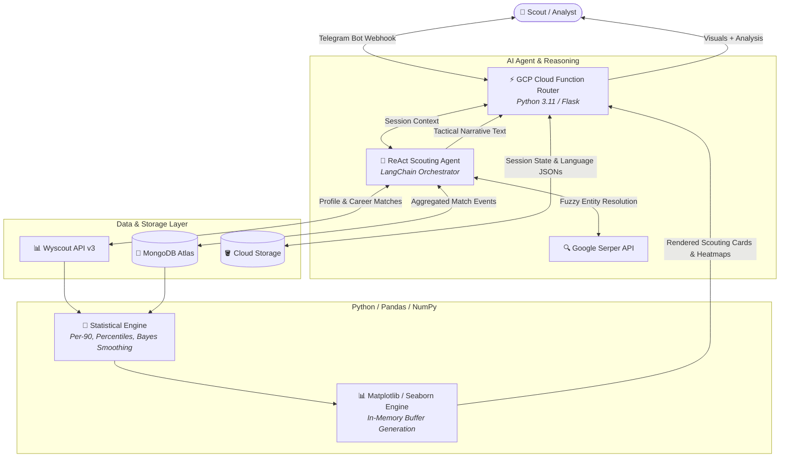

# ⚽ AI Football Scouting Assistant (`llm_bot`)

> **Production-Ready Serverless AI Scouting Intelligence** built with **Python 3.11**, **LangChain**, **Google Cloud Functions (Gen 2)**, **Wyscout API v3**, **MongoDB Atlas**, and **Telegram Bot API**.

---

## 💡 Core Architectural Philosophy: Deterministic Truth vs. Cognitive Synthesis

A fundamental design principle of this system is the **strict separation between mathematical computation and natural language generation**:



- **Why this matters**: LLMs frequently hallucinate or approximate floating-point math, percentiles, and statistical aggregations. In this architecture, **the LLM is never treated as a source of numerical truth**. 
- All statistics, league-wide percentile rankings, and chart distributions are calculated **deterministically in Python** against verified database baselines before being supplied to the LLM solely for tactical context and narrative synthesis.

---

## 🎯 The Problem

Professional football scouting and recruitment workflows are hindered by fragmented tooling and manual data collation:
1. **Disjointed Data Silos**: Scouts analyze player profiles on Transfermarkt for contract and biographical details, but must manually cross-reference match databases on Wyscout for raw event data.
2. **Manual Normalization Overhead**: Raw match totals are meaningless without role-specific Per-90 normalization and league-relative percentile ranking. Computing these manually for dozens of candidates is slow and prone to human error.
3. **Report Generation Bottleneck**: Manually building visual cards, extracting league distribution curves, and drafting qualitative player summaries consumes hours that recruitment departments could spend evaluating talent.

---

## 🛠️ My Contribution & Technical Ownership

As the sole backend & AI engineer on this project, I designed and implemented the full lifecycle:
- **System Architecture & Serverless Backend**: Built a modular, thread-safe serverless application deployed on Google Cloud Functions (Gen 2 / Cloud Run) utilizing Python's `contextvars` for concurrent session isolation.
- **Deterministic Statistics Engine**: Formulated the metric calculation pipelines, including Per-90 conversions, percentile rank mapping against dynamic league-role baselines, and **Bayesian smoothing (`bayes_rank`)** to handle small-sample bias.
- **Data Pipelines & Aggregations**: Wrote aggregation pipelines in MongoDB Atlas to group and sum raw match events across seasons, alongside custom REST wrappers for Wyscout API v3.
- **AI Agent Orchestration**: Engineered a ReAct-based tool-calling agent using LangChain that manages multi-step workflows (entity extraction, season switching, metric deep-dives, position discovery).
- **Automated Visualization Pipeline**: Implemented in-memory Matplotlib & Seaborn visual generators (custom scouting radar cards, peer distribution histograms, heatmaps, position breakdown pies) with explicit memory deallocation to prevent serverless memory leaks.
- **DevOps & Cloud Security**: Configured zero-secret deployment with GCP Secret Manager, CI/CD pipelines in GitHub Actions with Workload Identity Federation (WIF), and Telegram webhook secret verification.

---

## 🏗️ System Architecture & Dataflow



---

## 🤖 Tool Calling & ReAct Orchestration

The scouting assistant uses a modular registry of LangChain `@tool` functions invoked through a ReAct reasoning loop:

| Tool | Purpose | Deterministic Input/Output |
| :--- | :--- | :--- |
| `get_wyscout_id` | Resolves raw Transfermarkt URL $\rightarrow$ Wyscout player ID via search scraping + LLM extraction. | Parses biographical strings, queries Wyscout search endpoint, stores ID to session. |
| `get_player_career` | Assembles multi-season career records and builds interactive inline menus. | Queries MongoDB/Wyscout, computes total minutes, generates Telegram callback buttons. |
| `get_specific_season` | Evaluates player's full statistical profile for a selected season and position. | Pulls league baseline from MongoDB, calculates percentile ranks, calls LLM for qualitative analysis. |
| `plot_stat_breakdown` | Generates a league-wide peer distribution histogram for a single metric. | Queries Pandas DataFrame distribution, marks player's Per-90 & percentile, returns JPEG buffer. |
| `show_player_performance` | Renders a multi-metric Per-90 vs Percentile heatmap matrix. | Extracts position-specific metrics, formats Seaborn heatmap, returns image stream. |
| `show_player_positions` | Breaks down match minutes played across different tactical roles. | Aggregates event positions, groups into tactical buckets, renders pie chart. |
| `get_current_data` | Inspects currently cached session state and active player/season context. | Reads from GCS session store, formats overview string. |

---

## 🔌 Core Integrations

### 1. Wyscout API v3
- Fetches player biographical profiles, team details, official season definitions, and career appearance logs.
- Client credentials authenticated dynamically via secure environment variables.

### 2. MongoDB Atlas
- Stores aggregated season event data (`player_season_aggregated_stats`) and match-by-match raw records (`player_match_stats`).
- Executes MongoDB `$addFields`, `$match`, and `$project` aggregation pipelines to compute league-wide comparison datasets on demand.

### 3. Google Cloud Storage (GCS)
- Persists user session state (`{chat_id}.json`) to maintain multi-turn conversational context without stateful server memory.
- Stores metric configuration schemas (`metrics.csv`) defining tactical roles, display labels (EN/RU), and sorting directions.

### 4. Google Cloud Functions (Gen 2) & Secret Manager
- Fully serverless HTTP runtime scaling automatically from 0 instances.
- Zero credentials stored in code or repository; secrets are dynamically mounted at runtime from **GCP Secret Manager**.

### 5. Telegram Bot API
- Dual interface supporting freeform natural language text queries and interactive inline keyboard menus.
- Automatic message segment chunking (under Telegram's 4,096 character limit) and native photo payload streaming.

---

## 🧠 Hard Technical Challenges & Solutions

### 1. Small-Sample Variance & Extreme Outliers
- **The Challenge**: A player with 2 successful dribbles on 2 attempts would rank at the 100th percentile (100% success rate), heavily skewing scouting evaluations.
- **The Solution**: Implemented a **Bayesian weighted smoothing algorithm (`calculate_beta_raw`)** for attempt-based metrics:
  $$\text{Bayes Rank} = \frac{R \cdot v + C \cdot m}{v + m}$$
  where $m$ is the attempt volume of the 80th-percentile player, $C$ is the global league mean, $v$ is the player's attempts, and $R$ is their raw success rate.

### 2. Fuzzy Entity Resolution Across Disparate Platforms
- **The Challenge**: Transfermarkt URLs contain unstructured transliterations and localized names that do not match Wyscout's internal search index directly.
- **The Solution**: Built a two-stage resolution pipeline: Google Serper API scrapes the structured metadata $\rightarrow$ lightweight LLM extracts exact `Name` and `Birth Date` $\rightarrow$ Wyscout Search API queries candidate IDs $\rightarrow$ LLM selects the exact match based on birth date and team context.

### 3. Serverless Memory Leak Prevention with Matplotlib
- **The Challenge**: Cloud Function instances reuse warm containers. Generating repeated Matplotlib figures without explicit destruction leads to memory bloat and container termination (OOM).
- **The Solution**: Configured non-interactive backend (`matplotlib.use('Agg')`), wrote all plot binaries directly into in-memory `io.BytesIO` streams, and enforced deterministic figure cleanup via `plt.close(fig)` in `finally` blocks.

### 4. Concurrency & Stateless Request Isolation
- **The Challenge**: Serverless runtimes handling simultaneous HTTP webhooks risk race conditions if user state or chat IDs are stored in module globals.
- **The Solution**: Refactored the entire agent pipeline to use Python's `contextvars.ContextVar("current_chat_id")`, guaranteeing complete context isolation across concurrent async requests.

---

## 🔮 What I Would Do Differently Today

1. **Decoupled Asynchronous Queue (Pub/Sub + Cloud Tasks)**:
   - *Current limitation*: Complex multi-season MongoDB aggregations combined with LLM narrative generation can take 8–12 seconds, nearing Telegram's webhook timeout limit.
   - *Improvement*: Return an immediate `200 OK` acknowledgment to Telegram, offload the processing to a Google Cloud Task worker, and push the completed report asynchronously.

2. **Vector Similarity Search for "Player Comparison" (pgvector / Qdrant)**:
   - *Current limitation*: Comparative analysis requires manual selection of another player.
   - *Improvement*: Embed normalized percentile vectors into a vector database to enable one-click *"Find statistical twins / replacement candidates"* across all indexed leagues.

3. **Distributed Redis Caching Layer**:
   - *Current limitation*: Repeated queries for popular players invoke third-party Wyscout API calls repeatedly.
   - *Improvement*: Add an Upstash/Memorystore Redis cache with a 24-hour TTL for static player profiles and career logs to significantly reduce API costs.

4. **Modern LangChain LCEL & Structured Outputs**:
   - *Current limitation*: The legacy ReAct zero-shot agent parses text via regex strings.
   - *Improvement*: Migrate to LangChain Expression Language (LCEL) with native OpenAI / Gemini Tool Calling (`with_structured_output`) for faster, strictly typed JSON responses.

---

## 📁 Repository Structure

```text
llm_bot/
├── main.py                     # Serverless HTTP entry point & Telegram webhook router
├── config.py                   # Environment & Secret Manager variables + client factories
├── storage.py                  # GCS session state loader/saver & localization loader
├── database.py                 # MongoDB client & match/season aggregation pipelines
├── telegram.py                 # Telegram Bot API client (chunked messages, menus, photos)
├── metrics.py                  # Deterministic math (percentiles, Bayesian Bayes Rank, per-90s)
├── charts.py                   # Matplotlib / Seaborn visualization rendering (cards, heatmaps, pies)
├── agent.py                    # LangChain ReAct agent & decoupled tool definitions
├── loc_en.json                 # English localization strings
├── loc_ru.json                 # Russian localization strings
├── generate_brief_pdf.py       # ReportLab PDF executive brief generator
├── requirements.txt            # Python runtime dependencies
├── .env.example                # Secret Manager & environment variable reference
└── .github/
    └── workflows/
        └── deploy.yml          # CI/CD deployment workflow for GCP Cloud Functions
```

---

## 🚀 Quickstart & Local Setup

### 1. Installation
```bash
# Clone the repository
git clone https://github.com/Creeepling/ai-football-scouting-bot.git
cd ai-football-scouting-bot

# Create and activate virtual environment
python -m venv venv
source venv/bin/activate  # Windows: venv\Scripts\activate

# Install dependencies
pip install -r requirements.txt
```

### 2. Environment Configuration
Copy `.env.example` to `.env` and provide your credentials:
```bash
cp .env.example .env
```

| Key | Purpose |
| :--- | :--- |
| `SERPER_API_KEY` | Google Serper API key for entity resolution |
| `OPENAI_API_KEY` | OpenAI API key (or Google Gemini API key) |
| `MODEL_NAME` | Default LLM model (e.g. `gemini-3-flash-preview` or `gpt-4o-mini`) |
| `TELEGRAM_BOT_TOKEN` | Telegram Bot API token from `@BotFather` |
| `TELEGRAM_WEBHOOK_SECRET` | Secret token for validating incoming Telegram webhooks |
| `ADMIN_TELEGRAM_ID` | Telegram chat ID for admin alerts and error traces |
| `WYSCOUT_USERNAME` | Wyscout API username |
| `WYSCOUT_PASSWORD` | Wyscout API password |
| `MONGO_USERNAME` | MongoDB Atlas database username |
| `MONGO_PASSWORD` | MongoDB Atlas database password |
| `MONGO_HOST` | MongoDB Atlas cluster host URI |
| `GCS_BUCKET_NAME` | Google Cloud Storage bucket name for session state |

---

## 🚢 Deployment to Google Cloud Platform

### Automated CI/CD (GitHub Actions)
The repository includes an automated workflow in `.github/workflows/deploy.yml` utilizing **Workload Identity Federation (WIF)**. Configure the following GitHub Secrets to enable automatic deployments on `git push origin main`:
- `GCP_PROJECT_ID`
- `GCP_DEPLOYER_SERVICE_ACCOUNT`
- `GCP_WORKLOAD_IDENTITY_PROVIDER`

### Manual Deployment via Google Cloud CLI
```bash
gcloud functions deploy llm-scouting-bot \
  --gen2 \
  --runtime=python311 \
  --region=europe-west1 \
  --source=. \
  --entry-point=handler \
  --trigger-http \
  --allow-unauthenticated \
  --memory=1024Mi \
  --timeout=120s \
  --set-secrets="SERPER_API_KEY=SERPER_API_KEY:latest,OPENAI_API_KEY=OPENAI_API_KEY:latest,TELEGRAM_BOT_TOKEN=TELEGRAM_BOT_TOKEN:latest,TELEGRAM_WEBHOOK_SECRET=TELEGRAM_WEBHOOK_SECRET:latest,WYSCOUT_USERNAME=WYSCOUT_USERNAME:latest,WYSCOUT_PASSWORD=WYSCOUT_PASSWORD:latest,MONGO_USERNAME=MONGO_USERNAME:latest,MONGO_PASSWORD=MONGO_PASSWORD:latest" \
  --set-env-vars="ADMIN_TELEGRAM_ID=127932719,GCS_BUCKET_NAME=llmpafosfc,MONGO_HOST=analyticalplatform.cnoaz.mongodb.net,MONGO_DATABASE=analyticalplatform,MODEL_NAME=gemini-3-flash-preview"
```

---

## 📄 License
MIT License.
