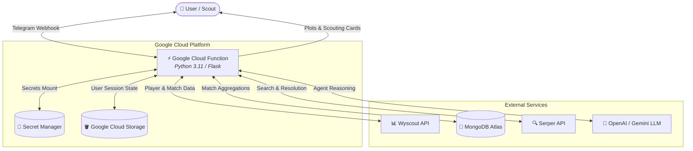

# ⚽ AI Football Scouting Assistant (`llm_bot`)

An enterprise-grade, serverless AI football scouting intelligence bot built with **LangChain**, **Google Cloud Functions (Gen 2)**, **Wyscout API**, **MongoDB Atlas**, and **Telegram Bot API**.

The assistant transforms raw event and match data into scout-ready intelligence reports, career analyses, percentile rankings, and dynamic visualizations (scouting cards, peer distribution histograms, heatmaps, and position pie charts).

---

## 🌟 Key Features

- **ReAct AI Scouting Agent**: Uses LangChain tool-calling to resolve Transfermarkt links, query Wyscout player careers, compute league-relative metrics, and generate nuanced tactical player evaluations.
- **Dynamic Statistical Visualizations**:
  - **Player Scouting Card**: Visual ranking card showing position-weighted percentiles across key performance indicators.
  - **Metric Distribution Histograms**: Real-time league-wide distributions placing the player against peers.
  - **Performance Heatmaps**: Per-90 vs Percentile multi-metric comparison matrices.
  - **Position Breakdown**: Pie chart showing minutes played per tactical role across a season.
- **Serverless & Scalable**: Runs on Google Cloud Functions (Gen 2 / Cloud Run) with thread-safe `contextvars` request isolation and zero memory leaks.
- **Enterprise Security**: Zero-secret code architecture; seamlessly mounts credentials via **GCP Secret Manager** and authenticates deployment pipelines with **Workload Identity Federation (WIF)**.
- **Bi-lingual Support**: Native English and Russian localization with interactive Telegram inline keyboard menus.

---

## 🏗️ System Architecture



---

## 📁 Project Structure

```text
llm_bot/
├── main.py                  # Serverless HTTP entry point & Telegram webhook dispatcher
├── config.py                # Configuration, secret loading & Wyscout client factory
├── storage.py               # Google Cloud Storage session loader & localization engine
├── database.py              # MongoDB Atlas match/season aggregation pipelines
├── telegram.py              # Telegram Bot API client (chunked messages, menus, images)
├── metrics.py               # Statistical math (percentiles, Bayesian ranking, per-90s)
├── charts.py                # Matplotlib / Seaborn visualization generators
├── agent.py                 # LangChain ReAct agent & tool definitions
├── loc_en.json              # English localization strings
├── loc_ru.json              # Russian localization strings
├── requirements.txt         # Production dependencies
├── .env.example             # Environment template
└── .github/
    └── workflows/
        └── deploy.yml       # CI/CD deployment workflow for GCP Cloud Functions
```

---

## 🚀 Quickstart & Local Setup

### 1. Prerequisites
- Python 3.11+
- Google Cloud Platform account with Cloud Functions & Secret Manager enabled
- MongoDB Atlas cluster
- Wyscout API account
- Telegram Bot Token (from [@BotFather](https://t.me/BotFather))

### 2. Installation
```bash
# Clone the repository
git clone https://github.com/your-username/llm-scouting-bot.git
cd llm-scouting-bot

# Create virtual environment
python -m venv venv
source venv/bin/activate  # On Windows: venv\Scripts\activate

# Install dependencies
pip install -r requirements.txt
```

### 3. Environment Variables
Copy `.env.example` to `.env` and fill in your credentials:
```bash
cp .env.example .env
```

| Variable | Description |
| :--- | :--- |
| `SERPER_API_KEY` | Google Serper API key for resolving Transfermarkt URLs |
| `OPENAI_API_KEY` | OpenAI API Key (or Google Gemini API Key) |
| `MODEL_NAME` | Default LLM model (e.g. `gemini-3-flash-preview` or `gpt-4o-mini`) |
| `TELEGRAM_BOT_TOKEN` | Telegram Bot API token |
| `TELEGRAM_WEBHOOK_SECRET` | Optional webhook verification token |
| `ADMIN_TELEGRAM_ID` | Telegram chat ID for administrative and error alerts |
| `WYSCOUT_USERNAME` | Wyscout API username |
| `WYSCOUT_PASSWORD` | Wyscout API password |
| `MONGO_USERNAME` | MongoDB Atlas database username |
| `MONGO_PASSWORD` | MongoDB Atlas database password |
| `MONGO_HOST` | MongoDB Atlas cluster host URI |
| `GCS_BUCKET_NAME` | GCS bucket for user session JSONs and `metrics.csv` |

---

## 🚢 Deployment to Google Cloud Platform

### Continuous Deployment via GitHub Actions
The repository includes an automated CI/CD pipeline in `.github/workflows/deploy.yml` using **Workload Identity Federation**:

1. Configure GitHub Repository Secrets:
   - `GCP_PROJECT_ID`
   - `GCP_DEPLOYER_SERVICE_ACCOUNT`
   - `GCP_WORKLOAD_IDENTITY_PROVIDER`
2. Push changes to the `main` branch to trigger an automatic deployment.

### Manual Deployment via Google Cloud CLI
```bash
gcloud functions deploy llm-scouting-bot \
  --gen2 \
  --runtime=python311 \
  --region=europe-west1 \
  --source=. \
  --entry-point=handler \
  --trigger-http \
  --allow-unauthenticated \
  --memory=1024Mi \
  --timeout=120s \
  --set-secrets="SERPER_API_KEY=SERPER_API_KEY:latest,OPENAI_API_KEY=OPENAI_API_KEY:latest,TELEGRAM_BOT_TOKEN=TELEGRAM_BOT_TOKEN:latest,WYSCOUT_USERNAME=WYSCOUT_USERNAME:latest,WYSCOUT_PASSWORD=WYSCOUT_PASSWORD:latest,MONGO_USERNAME=MONGO_USERNAME:latest,MONGO_PASSWORD=MONGO_PASSWORD:latest" \
  --set-env-vars="ADMIN_TELEGRAM_ID=127932719,GCS_BUCKET_NAME=llmpafosfc,MONGO_HOST=analyticalplatform.cnoaz.mongodb.net,MONGO_DATABASE=analyticalplatform,MODEL_NAME=gemini-3-flash-preview"
```

---

## 📄 License
MIT License.
